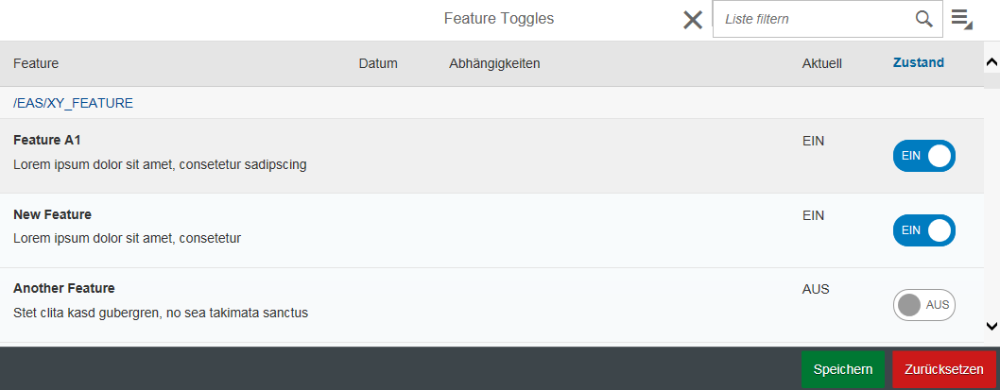

# Featuretoggle
A simple, lightweight feature toggle framework for ABAP

## What is it?
With this framework you can toggle features in ABAP-Code at runtime. This enables you to continuously deliver (potentially unfinished) Features in a deactivated state into the production system. This repository includes the ABAP backend and a UI5 GUI to manage toggle states.

## Requirements
* SAP 7.4
* [abapGit](https://github.com/larshp/abapGit)
* Eclipse + UI5/ADT Tools

## How to run it?
1. Create a new ABAP class which inherits the class `z_sy_feature` (see examples/z_xx_feature.abap).
2. Define new feature via class attribute 
3. Toggle feature via the transaktion `z_sy_feature` (opens UI5 frontend)
4. Check if feature is enabled by checking if `z_sy_feature=>feature_xx = abap_true` 

:warning: Features should never be enabled in production system!

### Examples
see /examples

### ToDo
* Change repository structure for easy cloning
* Import UI5-GUI via abapGit

## Installation

### Install ABAP Backend

1. Checkout/clone subfolder /src/abap/ via [abapGit](https://github.com/larshp/abapGit)
2. Check transaction `SICF` if node `/default_host/sap/bc/sy_feature` was created
3. Activate node `/default_host/sap/bc/sy_feature`
4. Check if feature is enabled by checking if `z_sy_feature=>feature_xx = abap_true`

### Installation UI5 Frontend 

1. Checkout/clone subfolder `/src/ui5/` 
2. Import project into Eclipse 
    * choose File->Import->Existing Projects into Workspace
    * choose cloned project folder
    * import project
3. Link projekt to a new BSP-Container in your SAP-System 
    * right click the newly created project and choose Team->Share Project
    * choose SAPUI5 ABAP Repository 
    * choose the connection to your SAP-System
    * choose "Create a new BSP Application" and fill out the required fields  (name must be `z_sy_feature`)
4. Deploy UI5 App to your SAP-System
    * right click the project and choose Team->Submit
    * select all objects
    * click finish
